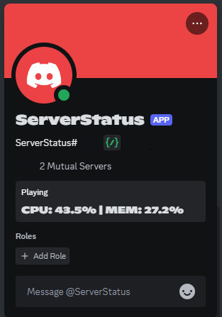

# SysMonitorBot

is a Discord Bot witten Go and Copilot.
CPU、Memoryの使用率を表示します。



## Usage

```bash
$ mk .env
$ echo "DISCORD_TOKEN=YourDidcordTokenHere" >> .env

$ go get
$ go run . -interval=5
```
intervalはStatusの更新間隔です。デフォルトは5秒です。

## Libraries

- [DiscordGo](https://github.com/bwmarrin/discordgo)
- [gopsutil](https://github.com/shirou/gopsutil)
- [dotenv](https://github.com/bkeepers/dotenv)
